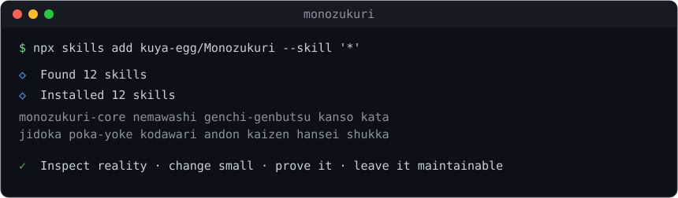

# monozukuri

`monozukuri` is a complete family of Agent Skills for building and maintaining
software as a craft rather than disposable output.



It combines Japanese-inspired quality principles with practical software
engineering: YAGNI, KISS, clear design, defect prevention, testing, security,
observability, documentation, and evidence-based review.

It is designed for both greenfield construction and existing codebases. The
target is maintainable software—not theoretically perfect software: code that
future maintainers can understand, verify, operate, and change safely.

The skill is deliberately **Japanese-inspired, not Japanese-prescriptive**.
It does not claim that developers in one country share a single engineering
style. The useful ideas are treated as metaphors for disciplined software work.

## The craftsmanship system

The umbrella skill applies this loop:

```text
Observe → Understand → Plan → Craft → Verify → Reflect → Kaizen
```

The repository also contains focused, independently installable skills:

| Skill | Focus |
| --- | --- |
| `nemawashi` | Clarify intent and prepare the design |
| `genchi-genbutsu` | Inspect the real repository and environment |
| `kanso` | Choose simple, durable designs |
| `kata` | Implement small, integrated vertical slices |
| `jidoka` | Debug failures and find root causes |
| `poka-yoke` | Prevent mistakes and design meaningful tests |
| `kodawari` | Review details that carry quality |
| `andon` | Make health and failure visible |
| `kaizen` | Improve code incrementally |
| `hansei` | Learn from failures and completed work |
| `shukka` | Release, migrate, and hand off responsibly |

## What it changes

When active, an agent should:

- clarify the problem before consequential work;
- inspect the real repository, environment, and constraints before changing it;
- make the smallest complete change;
- prevent invalid states and make failures visible;
- verify behavior instead of trusting generated code;
- avoid speculative abstractions, fake tests, and unrelated rewrites; and
- leave clear evidence, documentation, and residual-risk notes;
- build from scratch through the same craftsmanship loop as maintenance work.

## Install

### With the `skills` CLI

Umbrella skill only (`monozukuri-core`):

```bash
npx skills add kuya-egg/Monozukuri --skill monozukuri-core
```

Everything (umbrella plus all focused skills):

```bash
npx skills add kuya-egg/Monozukuri --skill '*'
```

One focused skill when you need a narrower workflow:

```bash
npx skills add kuya-egg/Monozukuri --skill nemawashi
npx skills add kuya-egg/Monozukuri --skill kodawari
```

The focused skills can also be used as a sequence. A typical greenfield path
is `nemawashi` → `genchi-genbutsu` → `kanso` → `kata` → `poka-yoke` →
`kodawari` → `andon` → `shukka`, followed by `hansei` and `kaizen` as the
system learns.

Each skill is a top-level `<name>/SKILL.md` directory, in the Agent Skills
format, discoverable by the `skills` CLI and compatible with any agent that
supports the format.

### As a Claude Code plugin

The repository is also a self-contained plugin marketplace. From Claude Code:

```text
/plugin marketplace add kuya-egg/Monozukuri
/plugin install monozukuri@monozukuri
```

This installs all 12 skills at once, namespaced under the `monozukuri` plugin.
`.claude-plugin/plugin.json` and `.claude-plugin/marketplace.json` define it;
`claude plugin validate .` passes.

## Use explicitly

```text
Use $monozukuri-core to review this change for correctness, maintainability,
failure handling, and AI-generated complexity.
```

## Name

The suite is `monozukuri`—the Japanese idea of craftsmanship and the art of
making things. Its umbrella skill is `monozukuri-core`; the other eleven carry
their own vocabulary names (`kaizen`, `jidoka`, `poka-yoke`, …).

## Sources and inspiration

The principles were synthesized from software-craft writing about kaizen,
jidoka, poka-yoke, nemawashi, documentation, incremental delivery, and
maintainability, including:

- [Japanese Quality Principles applied to Software](https://frappe.io/blog/engineering/japanese-quality-principles-applied-to-software)
- [From Kaizen to Wabi-Sabi](https://dev.to/dev_tips/from-kaizen-to-wabi-sabi-what-japanese-developers-taught-me-about-writing-code-that-lasts-mjl)
- [The Japanese Way of Coding](https://kenrickvaz.com/2025/07/30/the-japanese-way-of-coding/)
- [The Samurai Engineer](https://balaaagi.in/posts/the-samurai-engineer/)
- [The 56 Laws of Software Engineering: A Japanese Translation](https://zenn.dev/inspector/articles/laws-of-software-engineering-56-ja?locale=en)

These sources are inspiration, not authority. The skill favors practices that
can be explained, tested, and adapted to the actual project.
